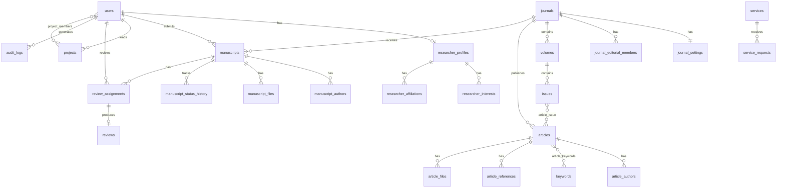

# Knowledge Dynamics — Database ERD

## Entity Groups

### Public Content
- journals → volumes → issues → articles
- articles ↔ keywords, article_authors, article_files, article_references

### Researcher Network
- users → researcher_profiles → interests, affiliations
- users → projects → project_members

### Manuscript Workflow
- manuscripts → manuscript_authors, manuscript_files
- manuscripts → manuscript_status_history
- manuscripts → review_assignments → reviews

### Services
- services → service_requests

### System
- settings, pages, audit_logs, legacy_url_mappings, doi_records
